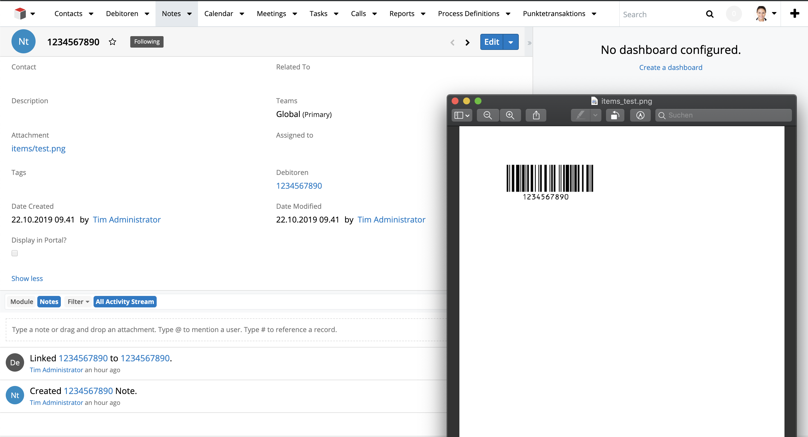

# Barcode

Azure Function to read a Barcode and Upload it to SugarCRM based on the value in the Barcode.

Azure Function is trigger on an Azure Blob Storage and reads the barcode. Here we use the libary pyzbar. All is in a DockerImage avavaible here:

https://cloud.docker.com/repository/docker/dajor85570/barcodedocker
