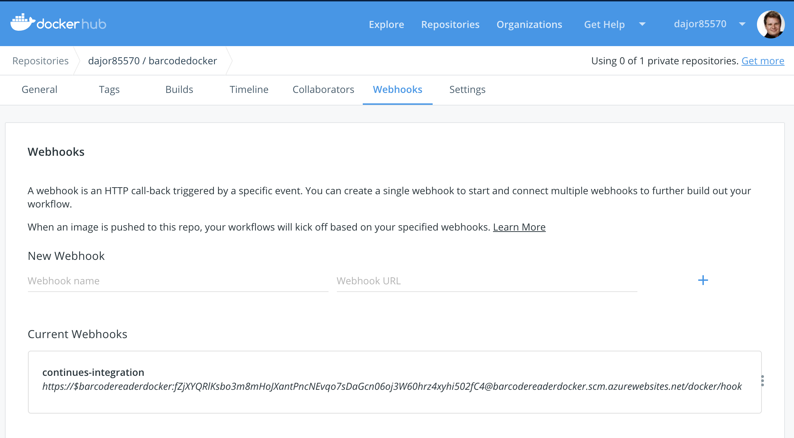

# Barcode

Azure Function to read a Barcode and Upload it to SugarCRM based on the value in the Barcode.


Azure Function is trigger on an Azure Blob Storage and reads the barcode. Here we use the libary pyzbar. All is in a DockerImage avavaible here:

https://cloud.docker.com/repository/docker/dajor85570/barcodedocker


###
# Before Login into Docker and Azure
# docker login  
# az login 

```{r, engine='bash', code_block_name}


export SugarURL="https://ludwigbeck-dev.crm-couch.com/"
export SugarUser="******"
# If your password have special character use escape 
export SugarPassword="*****"

export DockerImage=dajor85570/barcodedocker:v1.8


docker build --tag $DockerImage .   

docker push $DockerImage

az group create \
--name lb-barcodereaderdocker --location  westeurope 

az storage account create \
--name barcodereaderdocker \
--location westeurope \
--resource-group lb-barcodereaderdocker \
--sku Standard_LRS

## yellow error is okay - is more a information

az appservice plan create \
--name barcodereaderdocker \
--resource-group lb-barcodereaderdocker \
--sku B1 \
--is-linux


az functionapp create \
--resource-group lb-barcodereaderdocker \
--name barcodereaderdocker \
--storage-account  barcodereaderdocker \
--plan barcodereaderdocker \
--deployment-container-image-name $DockerImage


az storage account create \
--name barcodereaderfiles \
--location westeurope \
--resource-group lb-barcodereaderdocker \
--sku Standard_LRS


storageConnectionString=$(az storage account show-connection-string \
--resource-group lb-barcodereaderdocker \
--name barcodereaderfiles \
--query connectionString --output tsv) 

export AZURE_STORAGE_CONNECTION_STRING=$storageConnectionString

az storage container create -n "items" --public-access off

az functionapp config appsettings set --name barcodereaderdocker \
--resource-group lb-barcodereaderdocker \
--settings barcodereader_STORAGE=$storageConnectionString \
 SugarURL=$SugarURL \
 SugarUser=$SugarUser \
 SugarPassword=$SugarPassword


az functionapp restart --name barcodereaderdocker --resource-group lb-barcodereaderdocker


#############

###Now upload any files to items ---> and you see it in Sugar 


## And now the best - delete all the points we have done cleanly so we do not have all the storage etc to pay 

az group delete --name lb-barcodereaderdocker --yes

```

## Update 

```{r, engine='bash', code_block_name}

export SugarURL="https://ludwigbeck-dev.crm-couch.com/"
export SugarUser="******"
#### If your password have special character use escape 
export SugarPassword="*****"

export DockerImage=dajor85570/barcodedocker:v1.8

docker build --tag $DockerImage .   

docker push $DockerImage

storageConnectionString=$(az storage account show-connection-string \
--resource-group lb-barcodereaderdocker \
--name barcodereaderfiles \
--query connectionString --output tsv) 

storageConnectionString1=$(az storage account show-connection-string \
--resource-group lb-barcodereaderdocker \
--name barcodereaderdocker \
--query connectionString --output tsv) 


docker run -e AzureWebJobsStorage=$storageConnectionString1 -e SugarURL=$SugarURL \
  -e SugarUser=$SugarUser -e SugarPassword=$SugarPassword \
  -e barcodereader_STORAGE=$storageConnectionString $DockerImage


az functionapp config appsettings set --name barcodereaderdocker \
--resource-group lb-barcodereaderdocker \
--settings barcodereader_STORAGE=$storageConnectionString \
 SugarURL=$SugarURL \
 SugarUser=$SugarUser \
 SugarPassword=$SugarPassword \
 DOCKER_CUSTOM_IMAGE_NAME=$DockerImage


az functionapp deployment container config --enable-cd \
--query CI_CD_URL --output tsv \
--name barcodereaderdocker --resource-group lb-barcodereaderdocker


```



